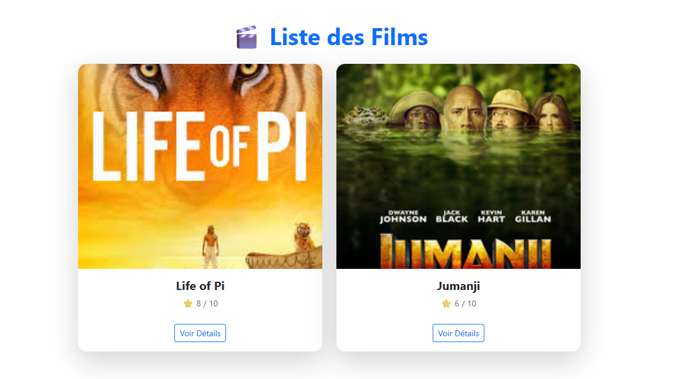
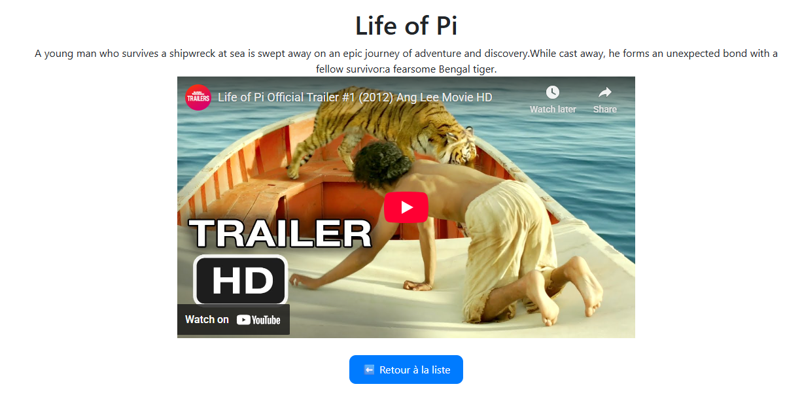

# 🎬 React Router Movies App

## 📖 Description
Cette application React affiche une **liste de films** avec leurs affiches, titres, descriptions et bandes-annonces.  
Chaque film possède sa propre page de détails grâce à **React Router**.

---

## 🖼️ Aperçu du projet

### 🎞️ Page d’accueil (Liste des films)


### 📄 Page de description d’un film


---

## ⚙️ Installation et exécution

1️⃣ **Ouvre ton terminal**, puis entre dans le dossier du projet :  
```bash
cd router_movies
```

2️⃣ **Installe les dépendances** :  
```bash
npm install
```

3️⃣ **Installe React Router et Bootstrap** :  
```bash
npm install react-router-dom bootstrap
```

4️⃣ **Lance le projet** :  
```bash
npm start
```

---

## 🧩 Technologies utilisées
- ⚛️ **React JS**
- 🧭 **React Router DOM**
- 🎨 **Bootstrap**

---

## 💡 Fonctionnalités principales
✅ Afficher une liste de films avec titre, image, description et note  
✅ Navigation entre les pages grâce à React Router  
✅ Lecture du trailer YouTube intégré  
✅ Design simple et responsive avec Bootstrap  

---

## 📁 Structure du projet

router_movies/
│
├── src/
│   ├── App.js
│   ├── MovieList.js
│   ├── MovieDescription.js
│   ├── index.js
│   └── ...
│
├── public/
│   └── index.html
│
└── README.md
```

## 👩‍💻 Auteur
Projet réalisé par **Fatma Chenkaoui** 💫

